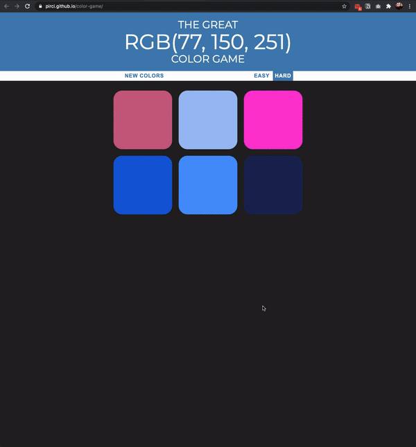

# Color Game Web App

> Color guessing game created using javascript. There are 2 different game modes, easy and hard. When the rgb code is selected correctly from the color boxes given, it paints the whole boxes in the specified color. The wrong predicted box disappears from the screen. It can be restarted with the "Try Again" button.

## Live Demo

Preview:  https://pirci.github.io/color-game/

## What I Learned:

- Applied and understanding JavaScript's "Conditional" Statements
- Improved prediction of alloys to rgb color codes (red, green, blue)
- The EventTarget method implemented
- Multiple types of CSS selectors

## Possible Improvements

- More code reviews can be added for teamwork
- Could make the page layout more pleasing to the eye
- Formatting could be improved when viewing on certain devices/browsers

> Any type of suggestions/improvements to this repo are always welcome.

